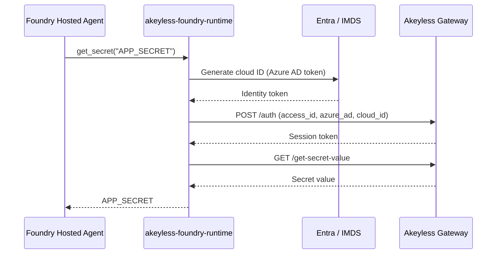

# akeyless-foundry-runtime

Fetch [Akeyless](https://www.akeyless.io) secrets at **runtime** on [Microsoft Foundry Hosted Agents](https://learn.microsoft.com/en-us/azure/foundry/agents/concepts/hosted-agents). Authenticate with **cloud identity** (Azure AD / Entra) — no long-lived API keys in your agent deployment. Application secrets stay in Akeyless, not Azure Key Vault.

Built on the [Akeyless Python SDK](https://pypi.org/project/akeyless/) with Foundry-specific auth defaults, path conventions, caching, and optional MCP tools.

**Repository:** [github.com/akeyless-community/foundry-akeyless-runtime](https://github.com/akeyless-community/foundry-akeyless-runtime)  
**PyPI:** [akeyless-foundry-runtime](https://pypi.org/project/akeyless-foundry-runtime/)

## Documentation

| Guide | Description |
|-------|-------------|
| **[Installation](docs/INSTALL.md)** | **pip install — no git clone required** |
| [Publishing to PyPI](docs/PYPI_PUBLISHING.md) | Trusted publishing setup for maintainers |
| [Akeyless setup](docs/AKEYLESS_SETUP.md) | Auth method, RBAC, secret paths — do this first |
| **[Foundry deploy](docs/FOUNDRY_DEPLOY.md)** | Hosted-agent env vars, Entra identity, invoke — after local test works |
| [Deployment patterns](docs/DEPLOYMENT.md) | In-agent fetch, hybrid, MCP server |
| [Examples](examples/README.md) | Runnable sample agents |
| [Security](SECURITY.md) | Production checklist and reporting |
| [Maintainer guide](docs/MAINTAINER.md) | Branch protection, approvals, PyPI environment |
| [Contributing](CONTRIBUTING.md) | Development setup and PR guidelines |

## Why this integration?

| Concern | Azure default pattern | This integration |
|---------|----------------------|------------------|
| **Authentication to secrets platform** | Agent identity → Key Vault | Agent Entra identity → Akeyless (Azure AD auth method) |
| **Secret storage** | Azure Key Vault | Akeyless (static, dynamic, rotated) |
| **Bootstrap credentials** | None (managed identity) | Only `AKEYLESS_ACCESS_ID` (no secret key) |
| **Rotation & governance** | Key Vault policies | Akeyless RBAC, rotation, audit |

Foundry Hosted Agents assign a dedicated Microsoft Entra identity at deploy time. This library uses that identity to generate an Akeyless **cloud ID** and authenticate — the same Azure AD pattern used by AKS, Functions, and other Akeyless integrations.

## Install

**No git clone needed.** Add to your agent project and install with pip.

### From PyPI (recommended)

```bash
pip install akeyless-foundry-runtime
```

With optional extras:

```bash
pip install 'akeyless-foundry-runtime[mcp]'
```

Add to your Foundry agent `requirements.txt`:

```text
akeyless-foundry-runtime>=0.1.0
```

### From GitHub (fallback)

```bash
pip install "akeyless-foundry-runtime @ git+https://github.com/akeyless-community/foundry-akeyless-runtime.git@v0.1.0"
```

Full install guide: **[docs/INSTALL.md](docs/INSTALL.md)**

Requires **Python 3.10+**.

## Quick start

### 1. Configure Akeyless

Follow **[docs/AKEYLESS_SETUP.md](docs/AKEYLESS_SETUP.md)** — create an Azure AD Auth Method, RBAC, and store secrets under `/foundry-agents/<agent>/<env>/`.

### 2. Test locally

```bash
cp .env.example .env   # edit with access_key auth for local test
python3 -c "from akeyless_foundry import get_secret; print('OK' if get_secret('APP_SECRET') else 'empty')"
```

Do not print secret values.

### 3. Deploy to Foundry

Follow **[docs/FOUNDRY_DEPLOY.md](docs/FOUNDRY_DEPLOY.md)** — set bootstrap env vars on the hosted agent, bind the agent Entra object ID in Akeyless, deploy, then invoke.

### 4. Set bootstrap env vars on the hosted agent

Configure only auth + path prefix — **not** application secrets:

| Variable | Required | Example |
|----------|----------|---------|
| `AKEYLESS_ACCESS_ID` | Yes | `p-xxxxx` |
| `AKEYLESS_ACCESS_TYPE` | No (default: `azure_ad`) | `azure_ad` |
| `AKEYLESS_SECRET_PREFIX` | Recommended | `/foundry-agents/my-agent/production` |
| `AKEYLESS_GATEWAY_URL` | No | `https://api.akeyless.io` |
| `FOUNDRY_AGENT_NAME` | No | `my-agent` |

### 5. Fetch a secret in your agent

```python
from akeyless_foundry import get_secret

app_secret = get_secret("APP_SECRET")
```

### 6. Deploy

Package and deploy as a Foundry Hosted Agent (container or source zip). See [examples/hosted-agent/](examples/hosted-agent/).

## Two ways to retrieve secrets

| API | Who calls it | Purpose |
|-----|--------------|---------|
| **`get_secret()`** | Your Python code | Bootstrap secrets at startup |
| **`get_akeyless_secret`** (tool) | The LLM / MCP client | On-demand secrets via MCP |

Both use the same Akeyless SDK under the hood (`auth` + get-secret-value / get-dynamic-secret-value / get-rotated-secret-value). The tool adds a JSON response layer.

```python
from akeyless_foundry import get_secret, AkeylessRuntimeClient

app_secret = get_secret("APP_SECRET")
client = AkeylessRuntimeClient()
client.get_dynamic_secret("azure-creds")
client.get_rotated_secret("api-key")
```

## API reference

### `get_secret(name)` — fetch a secret from your code

```python
from akeyless_foundry import get_secret

value = get_secret("APP_SECRET")
```

### `AkeylessRuntimeClient` — full client

```python
from akeyless_foundry import AkeylessRuntimeClient

client = AkeylessRuntimeClient(
    gateway_url="https://api.akeyless.io",
    secret_prefix="/foundry-agents/my-agent/production",
    access_id="p-xxxxx",
    access_type="azure_ad",
)

client.get_secret("APP_SECRET")
client.get_secret_json("APP_CONFIG")
client.get_dynamic_secret("azure-creds")
client.get_rotated_secret("api-key")
client.list_secrets()
```

### Agent tools — `get_akeyless_secret` / `list_akeyless_secrets`

```python
# pip install 'akeyless-foundry-runtime[mcp]'
from akeyless_foundry.tools.mcp import run_mcp_server
```

## Authentication

| Method | `AKEYLESS_ACCESS_TYPE` | Additional env |
|--------|------------------------|----------------|
| **Azure AD (recommended)** | `azure_ad` | `AKEYLESS_ACCESS_ID` |
| Access key | `access_key` | `AKEYLESS_ACCESS_ID`, `AKEYLESS_ACCESS_KEY` |
| API key | `api_key` | `AKEYLESS_ACCESS_ID`, `AKEYLESS_ACCESS_KEY` |
| Universal Identity | `universal_identity` | `AKEYLESS_UID_TOKEN` |
| JWT | `jwt` | `AKEYLESS_ACCESS_ID`, `AKEYLESS_JWT` |
| Pre-authenticated | — | `AKEYLESS_TOKEN` |

## Architecture



## Local development

```bash
export AKEYLESS_ACCESS_ID=p-xxxxx
export AKEYLESS_ACCESS_TYPE=access_key
export AKEYLESS_ACCESS_KEY=your-readonly-key
export AKEYLESS_SECRET_PREFIX=/foundry-agents/my-agent/dev

python3 -c "from akeyless_foundry import get_secret; print('fetched' if get_secret('APP_SECRET') else 'empty')"
```

## Related community projects

- [bedrock-agentcore-akeyless-runtime](https://github.com/akeyless-community/bedrock-agentcore-akeyless-runtime) — AWS Bedrock AgentCore
- [netlify-akeyless-runtime](https://github.com/akeyless-community/netlify-runtime) — Netlify Functions
- [fly-akeyless-runtime](https://github.com/akeyless-community/fly-runtime) — Fly.io Machines

## License

Apache-2.0
